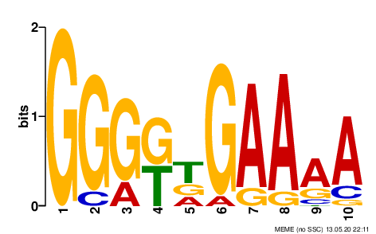
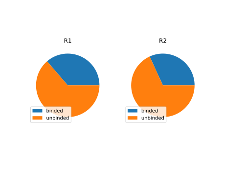

# BME1063 HW3 Report

**潘修齐 2018522077**

[toc]

## Workflow

To run all the scripts at one time, use the shell script `run_all.sh`

```shell
bash /scripts/run_all.sh
```


### Data Preprocessing

```shell
bash /scripts/3-bed2fasta.sh
```

The data file provided is peak point information encoded in bed format. Since supported file format for MEME is fasta and that for homer is peak region information encoded in bed format, a series of file conversion must be performed before any analysis.

The first step is to convert peak point into peak regions by manipulating the bed files given. It is tricky to choose which a appropriate region width. After trying different possible options, a region width of 50 was chosen at last. The manipulationg is done by R script modified from an internet version written by **Shamith Samarajiiwa**  [1] `scripts/1-extract_peak_region.R`.

The second step is to convert region containing bed files to fasta files. The issue combining 2 different stands is properly handled in this step usin script `2-add_strand_info.py`. The conversion step is done by bedtools. [2]

Output: `/results/1-peak_region_bed_combined`, `/results/2-peak_region_fasta`


### MEME-ChIP and MEME analysis

```shell
bash /scripts/4-run_meme.sh
```

There are two version of MEME available for our interest, classical MEME[3] and MEME-ChIP[4], which is MEME specially designed for ChIPseq data.

MEME-ChIP support ranges for motif width input, and a range of [4,10] was used in our case. For MEME, which only support fixed width, widths ranging from 4 to 10 was used.

Output: `/results/3-meme-chip_result`, `/results/4-meme_result`


### homer analysis

```shell
bash /scripts/5-run_homer.sh
```

Motif with width 6, 8, 10 was searched with homer[5] component `findMotifGenome`.

Output: `/results/5-homer_result`


### FIMO for sites count

```shell
bash /scripts/6-motif_count.sh
```

To know the fraction of protein binding motif, FIMO[6] in MEME suit was used. The MEME motif finding result of width 10 was searched upon reference genome, R1 and R2.

Output: `/results/6-fimo_counts`


## Results

### Motif of Interest (Q1)

The motif produced by searching 50 bp peak region using MEME under width 10 was chosen. It obtained much higher score than other candidates, which is expected in RAP/CLIP result, and shows no sign of high entropy on the edges. (It is the longest possible length given the homework info lolol) The results are also very similar between the 2 replicates.

For R1: 

For R2: 


### MEME-ChIP is a better motif finding tool for RAP/CLIP-Seq data (Q2)

2 criteria have been chosen to evaluate different tools used in this homework, namely the promise of the result and whether it is convenient to use.

For homer, no promising results was found. It is expected that, in RAP/CLIP-seq experiement , the motif found should be very high in confidence than other candidates, for they are experimentally enriched in the sequencing data. However, homer result shows no such characteristics, making its result invalid.

For MEME and MEME-ChIP, promising was found in both software. However, MEME-ChIP is more convenient to use for it supports range width input and is specially optimized for ChIP-seq-like experiments. 

In conclusion, ChIP-seq is a better motif finding tool for RAP/CLIP-Seq data.


### Peak region width is an important parameter for motif finding (Q3)

Through many trials and errors, the peak region width is found to be the most important parameter involved. For a super-short motif such as the one we found, a 500 bp region will be unreasonably large, and background repetitive sequences will add noise to the result.

In this particular case, the width 50 was decided by trials and errors. however, if more upstream data was provided, such as the peak-width in the peak-calling process, it will be much more easier.


### Bounded sites out of whole genome (Q4)

The found motif has 201 copies in the entire genome, among which 73 was detected in R1 and 64 was detected in R2.




## References

1. https://bioinformatics-core-shared-training.github.io/cruk-summer-school-2018/ChIP/Practicals/Practical7_Downstream_Analysis_of_ChIP-seq_SS.html#motif-enrichment-analysis
2. https://bedtools.readthedocs.io/en/latest/
3. http://meme-suite.org/tools/meme
4. http://meme-suite.org/tools/meme-chip
5. http://homer.ucsd.edu/homer/
6. http://meme-suite.org/doc/fimo.html